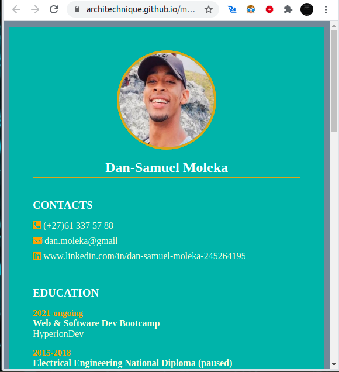

# myresume
WHAT IS IT ABOUT?

This website acts as my Curiculum Vitae/resume in which I share my a bio describing who I am, work experience, coding skills etc... I will be uploading this website occasionally to reflect my growth in terms of projects I have undertaken and/or completed.

CONTENT OF WEBPAGE

-Contacts: this section shares ways to get hold of me via mobile phone, email or linkdin.

-Education: a section detailing past and current education with year, certification and institution.

-Language: a section showing the languages I am fluent in (human language not programming)

-Bio: the section giving the reader some background information about my origins, who I am, my interests, passions and goals.

-Work Experience: section detailing my work experience with year, company name and work role/position with job description.

-Skills: section to highlight the proficiency my coding skills

-Interests: section sharing some of my daily interests

CLONE REPOSITORY TO YOUR LOCAL MACHINE

Follow the steps below to store the website's files locally:

-step1 : Click on the green 'Code' button above the list of files

-step2: Copy the URL link to clone the repository via HTTPS

-step3: Open your terminal and navigate to the desired directory

-step4: In terminal, type 'git clone' followed by the URL link you have pasted and press Enter

HOW TO USE

The website is a regular CV, hence there is not much interaction. The only interaction is when the reader would like to contact me, for which they would click on the email link.

Here are some screenshots of the CV with its sections.

